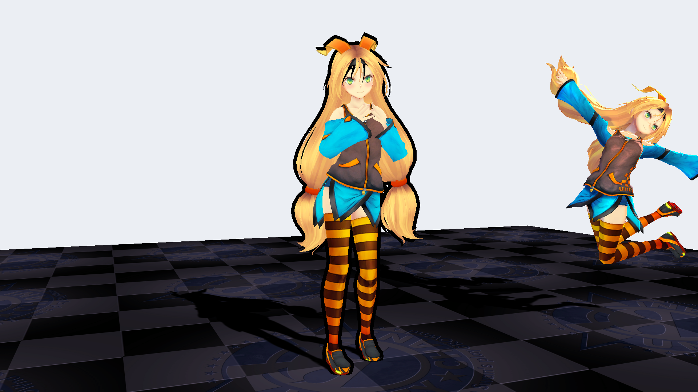
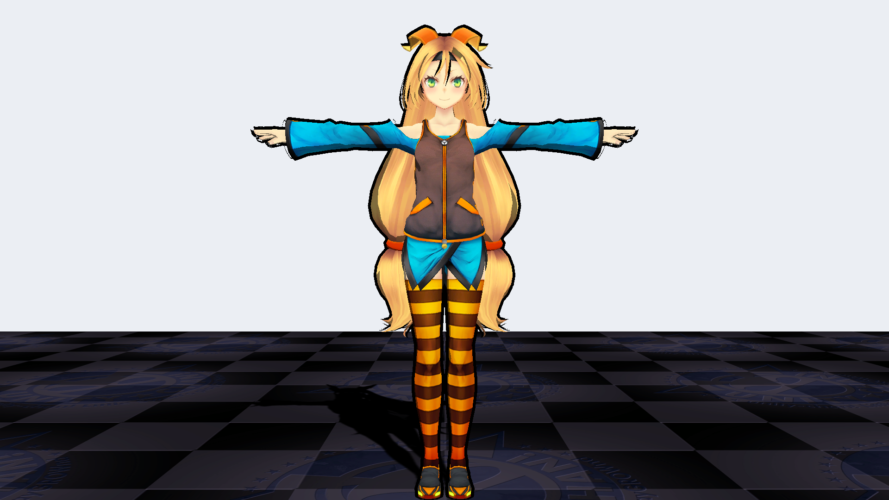

# Shaders
This repository will contain examples of shaders that I implemented (using mostly tutorials)

Asset was used as a test model [link](https://assetstore.unity.com/packages/3d/characters/unity-chan-model-18705)

<u></u>

Simple **cel shader** with outline in the center version with a new shader, on the right 
model with standard shades

<u></u>

**Ascii shader**

